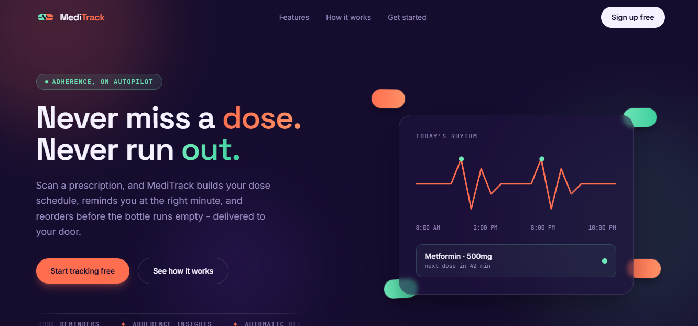

# 💊 MediTrack - Never Miss a Dose

MediTrack is a full-stack MERN medicine adherence and delivery platform that helps patients stay consistent with their medication schedule - combining prescription OCR, AI-powered auto-fill, smart reminders, adherence analytics, auto-reordering, and a caregiver mode for family members to monitor adherence remotely.

## 🖼️ Demo Preview



---

## 🤔 Why MediTrack

Missing doses and running out of medication are common, preventable problems - especially for elderly or chronically ill patients. MediTrack tackles this end-to-end: scan a prescription, get reminded at the right time, track adherence trends, and never run out of stock, with a trusted family member able to check in remotely.

---

## ✨ Features

- **JWT Authentication** - secure signup/login with hashed passwords
- **Medicine Management** - full CRUD for tracking dosage, frequency, timings, and stock, with a live low-stock indicator
- **Prescription OCR** - scan a prescription photo (Tesseract.js) and extract text automatically
- **AI-Powered Auto-fill** - LLM (Groq/Llama 3.1) converts messy OCR text into structured, ready-to-save medicine entries
- **AI Medicine Info** - a "Know more" popup asks the LLM for a plain-language summary of any medicine's uses, side effects, and precautions
- **Adherence Tracking** - logs every dose as taken/missed, calculates adherence % and streaks, visualized with area and pie charts
- **Smart Reminders** - cron jobs check schedules every few minutes and send email reminders
- **Auto-Reorder** - daily cron job detects low stock and automatically creates a refill order
- **Order Management** - place manual orders, track status (placed → packed → out for delivery → delivered)
- **Caregiver Mode** - invite a family member by email; once linked, they get a read-only dashboard of your schedule and adherence stats
- **Custom Design System** - animated hero, hand-drawn SVG capsule branding, and a coral/mint/indigo palette designed around the product's core metaphor: a heartbeat that doubles as a dose-schedule timeline

---

## 🛠️ Tech Stack

### Frontend
| Tech | Usage |
|------|-------|
| React 18 + Vite | UI Framework |
| React Router | Routing |
| Tailwind CSS | Styling (custom theme) |
| Axios | API Calls |
| Recharts | Adherence Charts |

### Backend
| Tech | Usage |
|------|-------|
| Node.js + Express | Server |
| MongoDB + Mongoose | Database |
| JWT + Bcrypt | Authentication |
| Tesseract.js | Prescription OCR |
| Groq API (Llama 3.1) | AI Auto-fill & Medicine Info |
| Node Cron | Reminders & Auto-Reorder |
| Nodemailer | Email Reminders |
| Multer | File Uploads |

---

## 📁 Project Structure

```
meditrack/
├── frontend/
│   ├── public/
│   ├── src/
│   │   ├── api/            → axios instance + one file per API resource
│   │   ├── components/     → Logo, MedicineInfoModal
│   │   ├── context/        → AuthContext (JWT + cross-tab sync)
│   │   ├── pages/          → one file per route
│   │   ├── App.jsx
│   │   └── main.jsx
│   └── package.json
└── backend/
    ├── config/db.js
    ├── controllers/
    ├── middleware/
    ├── models/
    ├── routes/
    ├── utils/              → cron scheduler, email service
    ├── server.js
    └── package.json
```

---

## 🚀 Getting Started (Local)

### Prerequisites
- Node.js 18+
- MongoDB URI (local or Atlas)
- Groq API key (free, no card required - [console.groq.com/keys](https://console.groq.com/keys))

### Backend Setup

```bash
cd backend
npm install
```

Create `.env` file:

```env
MONGO_URI=your_mongodb_uri
JWT_SECRET=your_jwt_secret
LLM_API_KEY=your_groq_api_key
EMAIL_USER=your_gmail_address       # optional - reminders log to console if not set
EMAIL_PASS=your_gmail_app_password  # optional
```

```bash
npm run dev
```

Backend runs on `http://localhost:5000`.

### Frontend Setup

```bash
cd frontend
npm install
```

Optionally create a `.env` file if your backend isn't running on the default URL:

```env
VITE_API_URL=http://localhost:5000
```

```bash
npm run dev
```

Frontend runs on `http://localhost:5173`.

---

## 🔌 API Overview

| Module | Base Route |
|---|---|
| Auth | `/api/auth` |
| Medicines | `/api/medicines` |
| Prescriptions (OCR) | `/api/prescriptions` |
| Adherence | `/api/adherence` |
| Orders | `/api/orders` |
| AI (medicine info + auto-fill) | `/api/llm` |
| Caregivers | `/api/caregivers` |

Full endpoint documentation is in the code comments above each route handler.

---

## 🖥️ Frontend Pages

| Route | Description |
|---|---|
| `/` | Landing page |
| `/auth` | Login / signup |
| `/dashboard` | Today's schedule, stats, dose logging |
| `/medicines` | Medicine CRUD |
| `/scan` | Prescription OCR upload + AI auto-fill |
| `/orders` | Place refill orders, view order history |
| `/analytics` | Adherence charts and trends |
| `/caregivers` | Invite/manage caregivers, view linked patients |
| `/caregivers/patient/:id` | Read-only patient view (caregiver side) |
| `*` | 404 |

---

## 🏗️ Architecture Notes

- **OCR runs entirely server-side** via Tesseract.js - no external API dependency for text extraction.
- **Auto-reorder logic** is a pure backend rule (`stockCount <= refillThreshold`) checked daily via cron - no ML involved, just reliable scheduled logic.
- **AI features are isolated to two specific use cases** (medicine info lookup, prescription-to-structured-data parsing) rather than bolted on everywhere, keeping the LLM's role narrow and purposeful.
- **Caregiver access is relationship-based**, not role-based - any user can be a patient, a caregiver, or both, and access is checked per-link on every request.

---

## 🎨 Design Notes

- **Palette**: deep indigo-violet (`#150C2E`) background with a coral/mint two-tone accent, echoing the split colors of an actual pill capsule rather than a generic medical blue.
- **Signature element**: an animated pulse line in the hero that doubles as a dose-schedule timeline - tying the app's "vitals" branding directly to its core function.
- **Typography**: Space Grotesk (display), Inter (body), JetBrains Mono (timestamps/labels).
- All icons are hand-drawn inline SVGs - no icon library - to keep a consistent visual language with the logo.
- Respects `prefers-reduced-motion`.

---

## 🌍 Deployment

| Part | Suggested Platform |
|------|----------|
| Frontend | Vercel / Netlify |
| Backend | Render / Railway |
| Database | MongoDB Atlas |

---

## 👩‍💻 About the Developer

**Nikita Tale** - Full-Stack Developer specializing in MERN Stack
Open to work! Let's connect →
[](https://www.linkedin.com/in/nikita-tale)
[](https://github.com/nikitatale)

---

> ⭐ If you found this project interesting, please star it - it helps a lot!
